| **Title** |  Attention Is All You Need |
|----------|-------------------------------------------------------------------------------------|
| **Author** | Ashish Vaswani |
| **Institution** | Google |
| **Venue** | NIPS   |
| **Year** | 2017 |
# Abstract
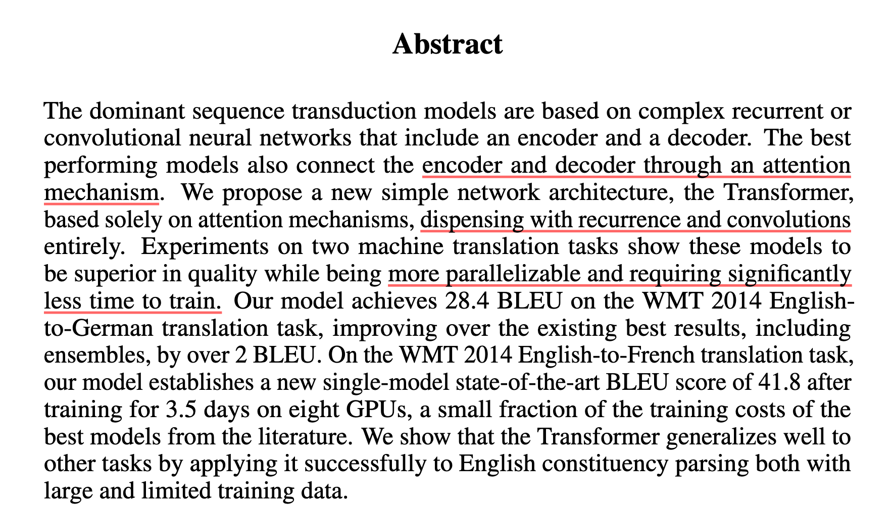
- SOTA model是用 Encoder、Decode 和 Attention 的架构
  - 当时仅局限于机器翻译
- 本文特点
  - 不使用循环和卷积的结构
  - 并行性更强
  - 训练时间更少

# Conclusion
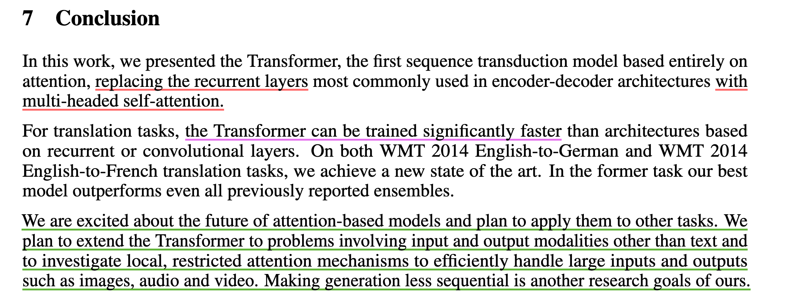
- 使用**多头自注意力层**代替循环层
- 训练时间快很多
- 未来方向的预测

# 1. Introduction
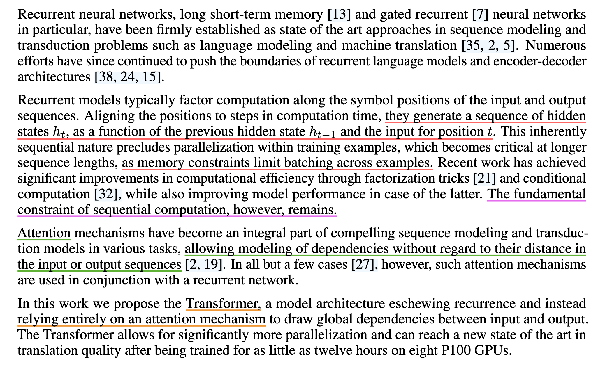
1. 指出 RNN 的缺点
   - **缺乏并行性**
     - RNN 需要顺序性，$h_t$ 的生成需要**顺序生成**前 $t-1$ 个 $h$ (即必须保证$t-1$ 个 $h$ **已经生成**)
       - $h$ 是隐藏状态，$h_t$ 包含了前 $t-1$ 个结点的所有信息
       - 这也是为什么 RNN 能很好的处理时序信息的原因
   - **内存开销大**
     - 如果 $t$ 过大，则会导致需要计算的 $h_t$ 也相应增大
2. 关于 RNN 的相关改进并没有从根本上解决问题
3. Attention 的作用是建立 Encoder 和 Decoder 的连接，**将 Encoder 的信息传给 Decoder**
4. Transformer **完全使用注意力机制**（减少时序计算），使得并行性增加，训练时间减少

# 2. Background
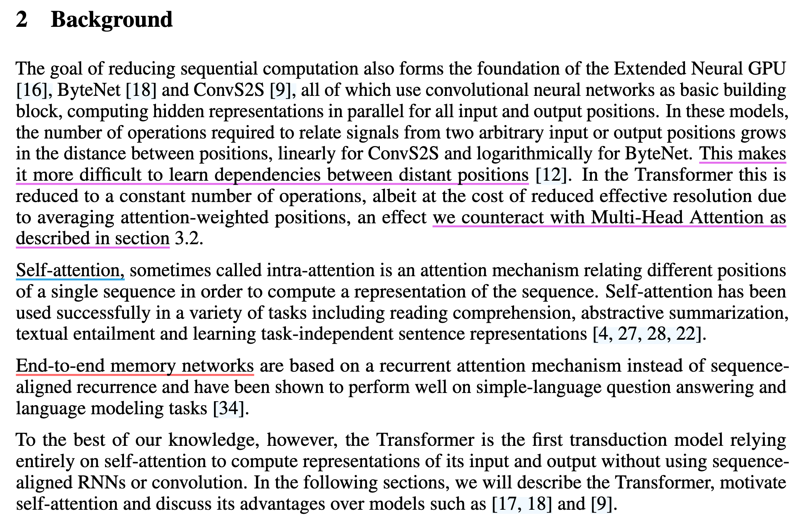
1. 卷积层对长时间序列的数据难以建模；相比之下，一层 Multi-Head Attention 就能实现多层卷积层的效果，同时可以维持卷积层的多输出通道的效果
  - 卷积覆盖范围较小，如果两个点距离过远，需要很多卷积层进行堆叠才能相交互
2. 自注意力机制
3. 端到端记忆网络

# 3. Model Architecture
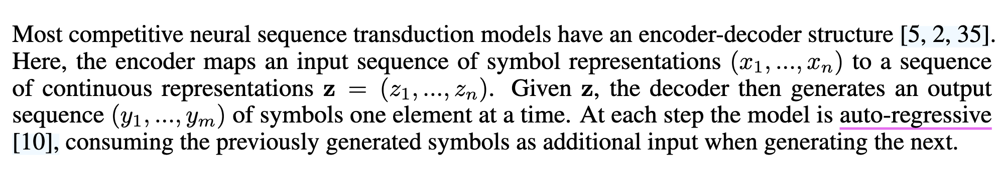
-  Encoder-Decoder结构
   -  Encdoer
      -  根据输入 $x_1, ... x_n$ 生成对应的向量 $z_1, ... z_t$
   -  Decoder
      -  将向量 $z_1, ... z_t$ 输入到 Decoder 后，它输出 $y_1, ... y_m$ (n 并不等于 m)
   -  Auto-regressive 模型
      -  即是输入也是输出
         -  Decoder 的输出是顺序输出的
         -  Decoder 的输出 $y_t$，需要输入 $y_{t-1}$
         -  过去时刻的输出是当前时刻的输入

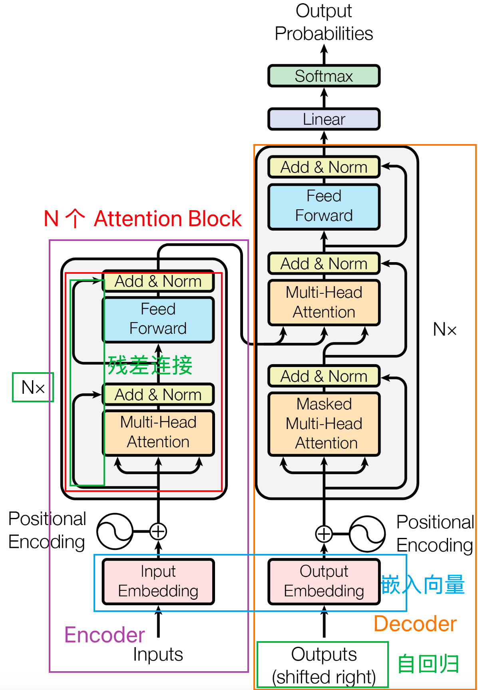
- Transformer **延续了 Encoder-Decoder 架构**
  - 由自注意力机制、point-wise和全连接层堆叠而成
- Encdoer 
  - 输入是源句
  - word(input) >> Vector >> Nx Attention Block >> Decoder (Attention Block)
- Decoder
  - 训练时，采用掩蔽机制
  - 预测时无输入，**自回归模型**
    - **每轮的输入是上一轮的输出**（图中的shifted right的意思）
    - 最开始的输入是开始符号
    - input(Auto-regressive) >> Vector >> Nx Attention Block (including **Masked Multi-Head Attention**) >> Linear >> Softmax >> Probabilities

## 3.1. Encoder and Decoder Stacks
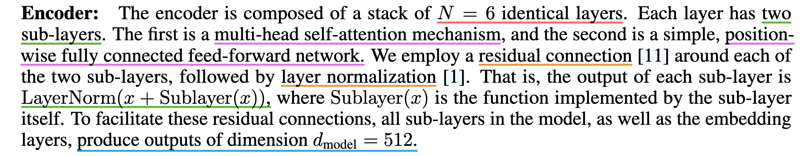
1. Encoder
   - Encoder 的 Attention Block 有六个
   - Attention Block 中含有两个子层
     - Multi-head Self-Attention
     - positionwise fully connected feed-forward network
      - 本质是个 MLP
   - 对子层使用残差连接和层归一化
   - 输出公式为 $LayerNorm(x+Sublayer(x))$
     - $Sublayer(x))$ 表示 x 经过子层的输出
     - $x + Sublayer(x))$ 表示残差连接
     - $LayerNorm(x+Sublayer(x))$ 表示归一化后的输出
   - 固定输出维度为 512
     - 残差需要输入和输出的维度一致
     - 和普通的神经网络不同
   - 只有两个参数可以调整，一个是 Attention Block 的个数，一个是维度 d 的大小

2. Decoder
   - 增加了一个多头注意力机制
   - 在训练的时候**使用 Mask** 遮蔽 t 时后的输入
     - 模拟在预测时，只能依靠 t 时刻前的信息

### Layer Normalization 与 Batch Normalization
- Function of Normalization
  - 减少梯度消失的问题
  - 每层特征输入激活函数前，进行归一化，将其转换为均值为0，方差为1的数据
- Batch Normalization
  - 对**每个特征的所有样本**进行归一化
- Layer Normalization
  - 对**每个样本的所有特征**进行归一化
  - 适用于**变长数据**
- Example
  - 二维
    - 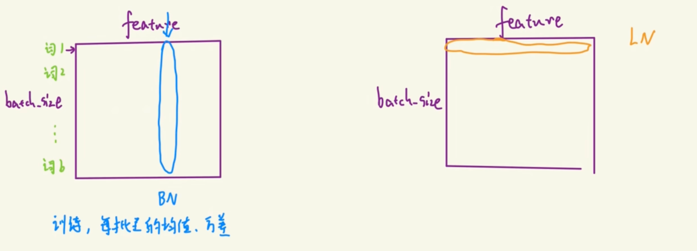
  - 三维
    - 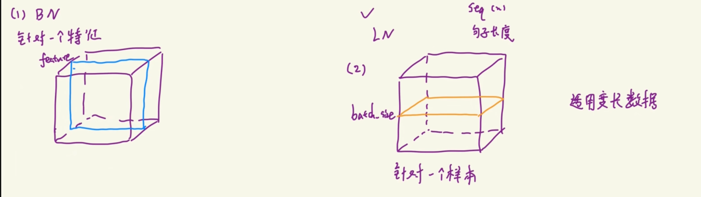'

## 3.2. Attention
- 给定 Query，计算它与所有键 K 的兼容性分数（常用点积）
  - $score(Q,K_i)=Q\cdot K_i$
- Softmax 为权重
  - $\alpha_i=softmax(score(Q,K_i)$)
- 对所有的值 $V_i$ 进行加权求和，得到最终输出
  - $output=\sum\alpha_i V_i$

## 3.2.1. Scaled Dot-Product Attention
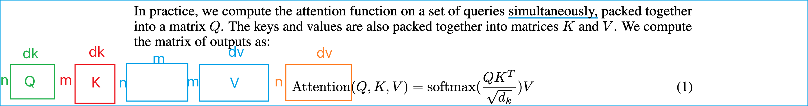
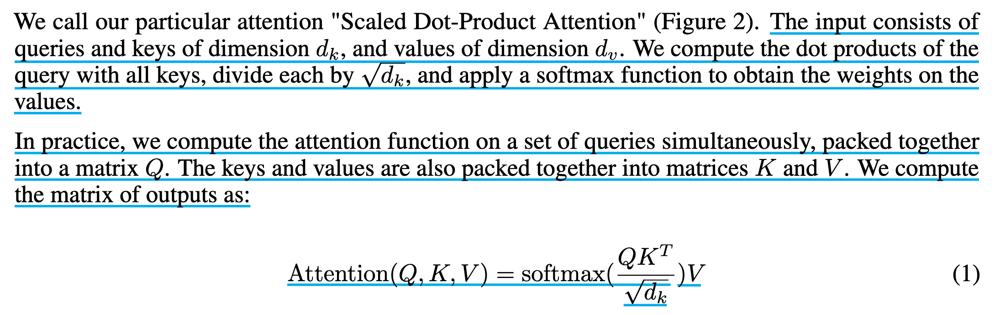
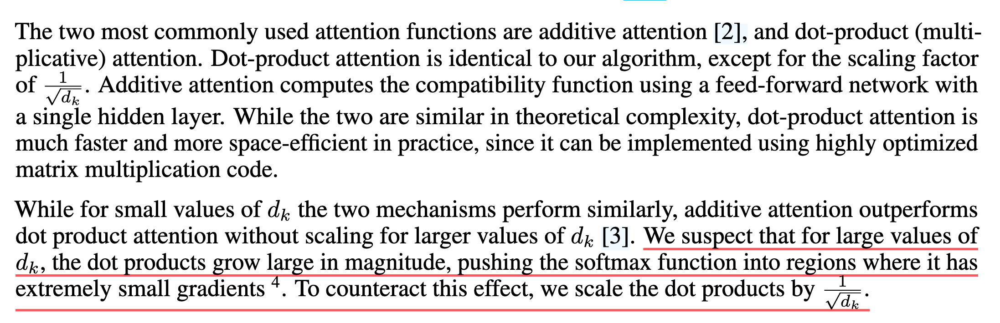
- 方法
  - 1. $Q$ 和 $K$ 以矩阵形式输入，作内积，得到 $n*m$ 的矩阵
    - 该矩阵的每一行代表 $Q_i$ 跟所有 $k$ 作内积的结果
  - 2. 除以 $\sqrt{d_k}$
  - 3. Softmax （行与行结果独立）
  - 4. 乘以 $v$，得到 $n*d_v$ 的矩阵
- 使用**两次矩阵乘法**就可以得到输出，显著增加了**并行性**
- 除以 $\sqrt{d_k}$ 的原因
  - 当 $d_k$ 比较大时（出现在输入向量很长的情况下），值间的相对差距比较大，进而导致梯度较小，除以$\sqrt{d_k}$可以缓解这种现象 
- MASK
  - 目的
    - TRANSFORMER 的目的是根据 $1,\cdots,t-1$ 时刻的输入 $K_1, \cdots, K_{t-1}$ 进行预测第 $t$ 时刻的输出，但注意力机制会使得 TRANSFOMRER 能看到 $K_t,\cdots, K_n$的输入，我们需要防止这个现象
  - 方法
    - 将 $K_{t}, K_{t+1}, \cdots$ 后的输出替换成一个非常大的负数，这样就能使得经过 $Softmax$ 后的相应输出为 0

## 3.2.2. Multi-Head Attention
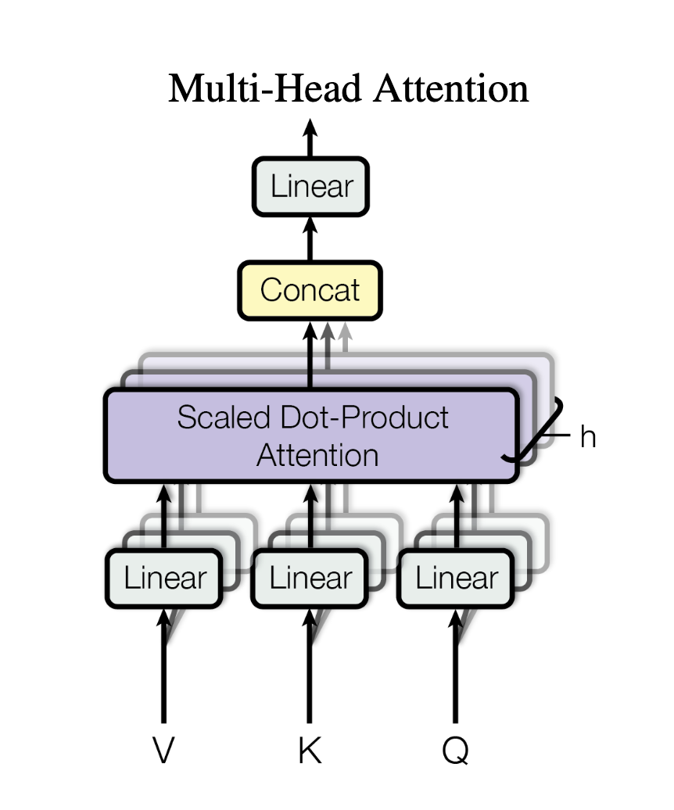
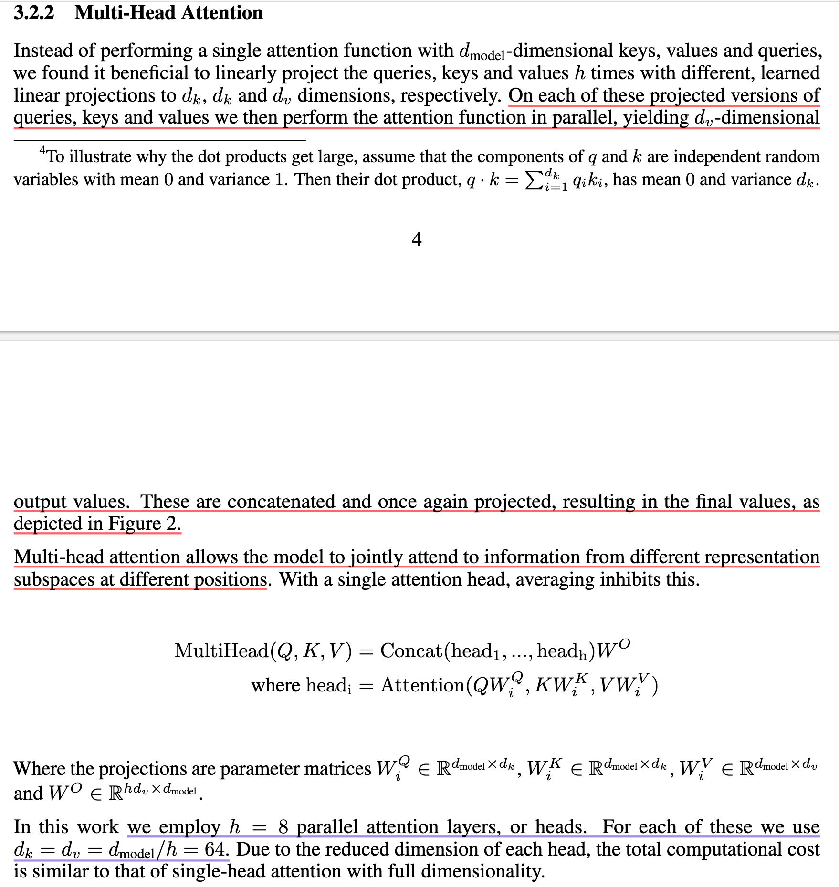
- 目的
  - 对$Q,K,V$ 的各维度的特征做线性组合
- 方法
  - 映射得到另一个维度大小的特征向量。然后用 $h$ 种权重如此重复 $h$ 次得到原始feature的 $h$ 种线性变换
  - 1. $V,K,Q$ 经过 $Linear$ 后，投影成低维度
  - 2. 经过 $h$ 次的 Scaled Dot-Product Attention 处理，得到 $h$ 个向量
  - 3. 合并 $h$ 个向量
  - 4. 经过 $Linear$ 再次投影
  - 5. 回到 multi-head attention
- 为什么需要 Multi-Head Attention
  - Scaled Dot-product Attention 中并没有什么可学习的参数，具体函数就是内积的计算
  - Multi-head Attention 的投影参数 $W$ 是可以学习的，可以通过不同的投影方式学习，去识别不同的模式
  - 参考卷积神经网络中的不同输出尺寸

## 3.2.3. Applications of Attention in out Model
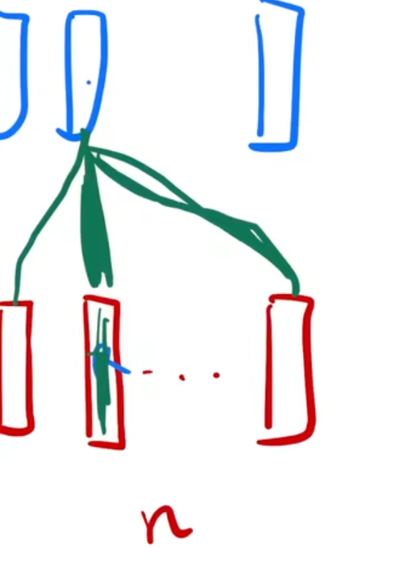
- Encoder 的 Multi-Head Attention
  - self-attention
  - i.e., 句子长度为 n，输入就是 n 个 d 维的向量
  - 这些向量同时会被作为 Query, Key, Value （自注意力机制）
  - 输出也是 n 个 d 维的向量
    - 就是输入的加权和，表示不同向量间的相似度
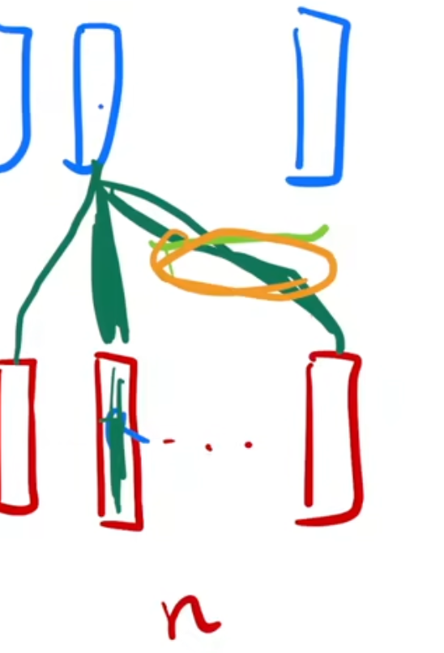
- Decoder 的 Masked Multi-Head Attention
  - Self-Attention
  - 与 Encoder 的注意力层的区别在于，它会屏蔽掉 $t$ 时刻后的输出，即将 $t$ 后的输出设置为 0 
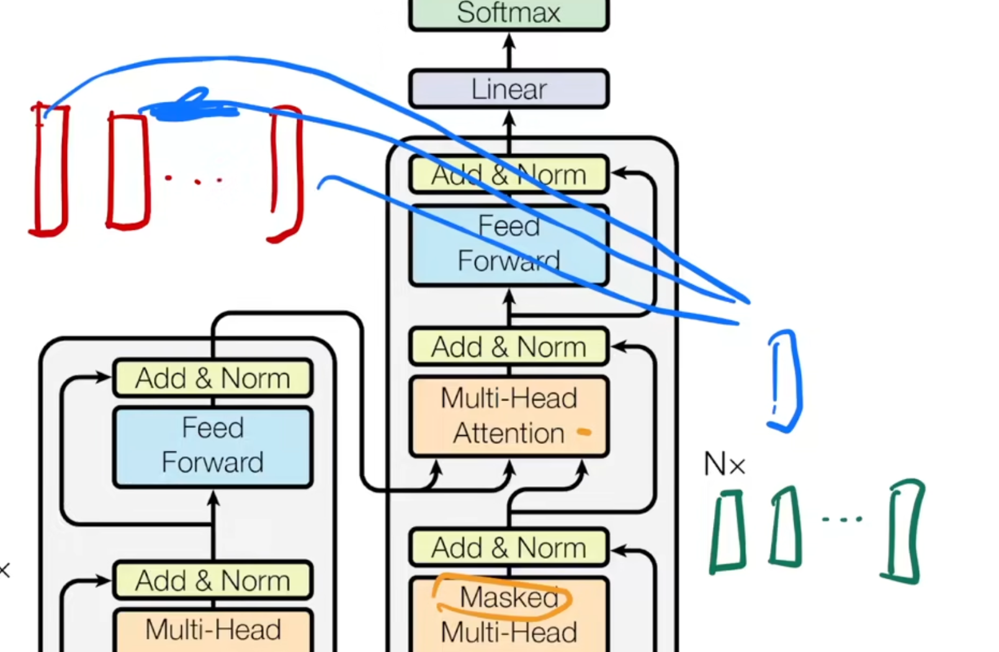
- Decoder 的 Multi-Head Attention
  - **不再是 Self-Attention**
  - Key 和 Value 来源于 Encoder 的输出
  - Query 来源于 Decoder 的 Masked Multi-Head Attention 的输出
    - 即计算每一个 Decoder 输出的 Query（绿色）关于 Encoder 输出的 Key 和 Value （红色）的相似程度，并输出（蓝色）
- i.e.， Hello World --> 你好世界
  - 计算 “好” 的时候，“好”作为 query ，会跟 “hello” 向量更相近一点，给 “hello” 向量一个比较大的权重
  - 但是 "world" 跟后面的词相关， "world" 跟 当前的query （“好” ）相关度没那么高
  - 在算 “好” 的时候，我会给“hello” 向量一个比较大的权重
  - 在算 query “世” 的时候，会给第二个 "world" 向量，一个比较大的权重
  - 根据解码器的输入的不一样，会根据当前的 query 向量，去在编码器的输出里面去挑我（当前 query）感兴趣的东西

## 3.3. Position-wise Feed-Forward Networks
- 本质是 MLP，将同一个 MLP 作用在每个词上
- 1. 线形层 $W_1$ : d(512) >> d(2048)
- 2. RELU 激活函数 $max$
- 3. 线形层 $W_2$ : d(2048) >> d(512)

## 3.4. Embedding and Softmax
- Embedding：
  - 使用 $d$ 维的向量表示任何一个词
  - 本文 d = 512
- 编码器、解码器、最后 softmax 之前的 3 个 embedding 共享权重。--> 训练更简单。
  - 在本文的 Embedding 层中，$weight * \sqrt{d_{model}}$
    - L2 正则化

## 3.5. Positional Encoding
- ATTENTION **不会处理时序信息**
  - 如果输入一个句子，和输入一个打乱后的句子，两者之间的语义会必然发生变化，但是对 ATTENTION 来说并不会，这个问题需要解决
  - 原因
    - Attention 的 output 是关于 Value 的加权和
      - 权重 $w$ 就是 $Q_i$ 和 $K_i$ 之间的距离，**与序列信息无关**
    - **即输入的顺序发生改变，输出值仍然不会变**
- 解决方法
  - attention 在输入里面加入时序信息 >> positional encoding
  - 使用和输入同纬度的向量表示位置信息，即该词是在输入的第几个位置
- 具体
  - 数入进来进入 embedding 层之后，那么对每个词都会拿到那个向量长为 512 的一个向量。positional encodding （这个词在句子中的位置），返回一个长为 512 的向量，表示这个位置，然后把 embeding 和 positional encodding 相加

# 4. Why Self - Attention
- Complexity per Layer 越少越好
  - self-attention: $O(n^2\cdot d)$ 
- Sequential Operations （下一步计算，必须要等前面多少步 计算完成） 越少，并行度越高 
  - self-attention: $O(1)$，矩阵乘法的并行度高
- Maximum Path Length（一个信息从一个数据点走到另外一个数据点要走多少步）越短越好
  - 任何两个 走多少步
  - self-attention: $O(1)$，一个 query 和所有的 key 做运算。输出是所有 value 的加权和。任何 query 和任意一个很远的 key-value pair，只要一次就能过来