| **Title** | Improving ML-based Binary Function Similarity Detection by Assessing and Deprioritizing Control Flow Graph Features  |
|----------|-------------------------------------------------------------------------------------|
| **Author** | Jialai Wang |
| **Institution** | Tsinghua Univeristy  |
| **Venue** | USENIX |
| **Year** | 2024 |

# ABSTRACT
1. 问题背景
   - 现有 BCSD 模型中将 CFG 作为函数特征的重要部分，并基于此学习特征
   - 但是，CFG 在模型决策中的具体作用并没有被系统性的研究，且 CFG 也可能会模型产生负面影响
2. 创新点
   - **首次**系统性的评估了 **CFG** 在**基于机器学习**的 **BCSD** 方法中的作用
   - 提出 $\delta$ CFG 
     - 1. 在不改变语义的情况下，灵活的操纵函数的 CFG。这使得可以验证当 CFG 发生变化时，模型将会发生什么反应
     - 2. 增强训练数据，以减少模型对 CFG 的依赖程度
3. 结论
   - 大多数模型对 CFG 特征有偏倚，当 CFG 特征发生变化时鲁棒性不足

# CONCLUSION
1. 首次系统性的评估 CFG 特征在 ML-BCSD 的作用
   - 发现现有模型对 CFG 特征过度依赖
2. $\delta$ CFG 
   - 用于研究 CFG 对模型决策的影响
   - 分析 对CFG 特征过度依赖的原因
   - 可以基于此对模型进行微调，减少 CFG 的依赖，并提升性能

# 1. INTRODUCTION
1. ML-Based BCSD 的定义
   - 将二进制函数转换成嵌入向量，使用几何度量计算函数间的相似性
   - 这种基于机器学习的方法有很大一部分是基于 CFG 学习函数的特征（语义）
2. 基于 CFG 方法的缺点
   - 1. 会导致 CFG 特征的过度依赖，限制对语义的理解
     - i.e., 在 CFG 中，对于**较远距离的基本块**的指令关系学习效果较差
   - 2. 作者使用 $\delta$ CFG 的测试结果验证了这一猜测
     - 函数的语义**保持不变**的情况下，对 CFG 进行修改
     - BCSD 的检测应该是基于**函数语义**的，也就是说，在这种情况下，模型的性能不应该发生改变，即原先被认定为相似的函数对，现在应该仍被判定相似
     - 但是结果显示，模型的性能发生显著下降，也就是说，模型在决策是更加关注 **CFG**，**而非函数的语义**
   - 3. 将**每个字节作为特征**是不合适的，二进制代码具有更高层次的语义
3. $\delta$ CFG
   - 1. 检测模型是否依赖 CFG
     - $\delta$ CFG 可以在不修改函数语义的情况下，更改 CFG 的内容
   - 2. 用于数据增强，增强后的模型，各种指标显著提升，并且，**缓解了**过度依赖 CFG 的问题
     - 通过降低 CFG 特征的优先级，改进模型
4. 本文的贡献点
   1. 对于 ML-BCSD 方法对于 CFG 的依赖定量评估和原因解释，并提供了一个鲁棒性验证工具，探究模型是否对 CFG 具有过度依赖
   2. 提出 $\delta$ CFG，并揭示了现有模型对 CFG 的高度依赖
   3. 基于 $\delta$ CFG 的数据增强方式，以降低对 CFG 的依赖

# 2. Brackground and Related Work
## 2.1. ML-BFSD Solutions
- ~~ML-BFSD方案的目标是计算两个二进制函数（原始字节）的相似性，以0（完全不相似）到1（完全相同）的相似度分数来衡量。由相同或一定程度上相似的源代码函数编译得到的两个函数（例如，其中一个是另一个的补丁版本）应获得较高的相似度分数~~
- ~~在实际应用中，给定的函数会与函数池中的所有函数进行比较。然后利用相似度分数对函数池中的函数进行排序，从中识别出与给定函数最接近的匹配项~~
~~- 控制流图（CFG）编码了函数结构，描绘了基本块之间的控制依赖关系。许多ML-BFSD方案将 CFG 视为关键组成部分~~
- 模型无依赖性
  - 本文提出的方法无论模型是否基于 CFG 都适用

## 2.2. Explanation Methods
- 使用**基于近似**的解释模型分析 CFG 的作用，步骤如下
- 1. 扰动特征值生成变体
   - 对于 $d$ 维的特征向量 $x=[x_1,\cdots, x_d]$，**随机改变某些特征值**，以生成与实例相近的变体
- 2. 采用可解释模型近似决策边界
   - i.e., 使用 $f$ 作为可解释模型
- 3. 计算特征贡献
   - 模型 $f$ 会生成一个向量 $a=[a_1,\cdots, a_n]$ ，其中 $a_i$ 表示特征 $x_i$ 对模型在输入实例 $x$ 上决策的贡献值

## 2.3. Divergence from Related Work
1. 之前的模型横评
   - 是在**同一数据集和指标**下观察不同设置对 BCSD 方法的影响，但并没有将 CFG 的依赖作为研究方向之一
2. 之前对 CFG 的测评
   - 1. 是基于**非机器学习**方法
   - 2. 基于经验或者直觉，不是系统系评估

# 3. Explainer: Explaining ML-BFSD Solutions
## 3.1. Feature Specification
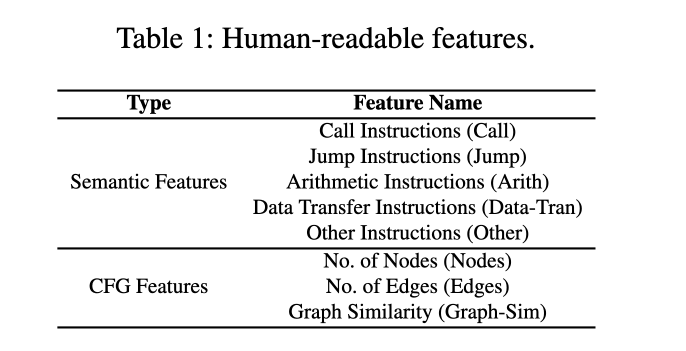
1. 语义特征
   1. 一阶段：将原始字节流反编译为指令
      1. 指令比原始字节流更具有可读性
      2. 指令能够保留源函数的语义
   2. 二阶段：将指令分类
      1. 指令的种类和数量过多，将其分为五个常见类型：**调用、跳转、算数、数据传输和其他**
      2. 不同类型的指令数量差距很大，需要经过**归一化**处理，得到最后的类型分数
2. CFG 特征
   1. **边的数量和点的数量**：基本属性，用于区分不同边数和点数的 CFG
   2. **图相似度**：当边数和点数相同时，需要靠**图相似度**进行区分

## 3.2. Local Approximation
### 3.2.1. Local instance generation
1. 核心思想
   - 通过删除指令的方式达到对 $x$ 扰动生成 $x'$
     - 删除某条指令后，对于 **CFG 特征**，它会影响到**边的数量和点的数量**，这都会进而影响到**图的相似度**
2. 具体方法
   - `Explainer` 随机删除 $q$ 条指令，其中 $q$ 从 $(0,\gamma]$ 采样
     - 限制采样区间以确保 $x'$ 近似 $x$ 
3. 结果
   - 生成了 $N$ 个 $x'$

### 3.2.2. Labeling training data
1. 核心思想
   - 使用 $x'$ 和 $x$ 的相似度作为标签，进而测量扰动对模型决策的影响

### 3.2.3. Model development
1. 线性假设
   - 使用线性回归模型 $f(x)=\sum(w_i,x_i)$ 局部近似决策边界
     - $w_i$ 反应了其对应的 $x_i$ 的重要性
   - 使用 `LIME` 方法训练*岭回归模型**
2. 非线性假设
   - 构建混合回归模型。使用 `LEMNA` 方法训练**高斯混合模型**

## 3.3. Explanation Results
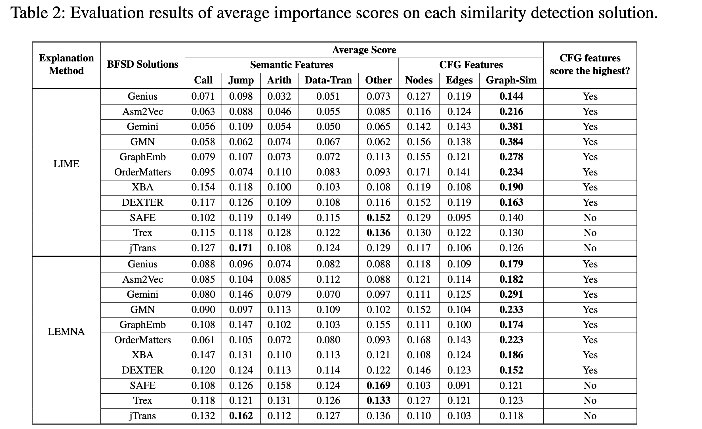
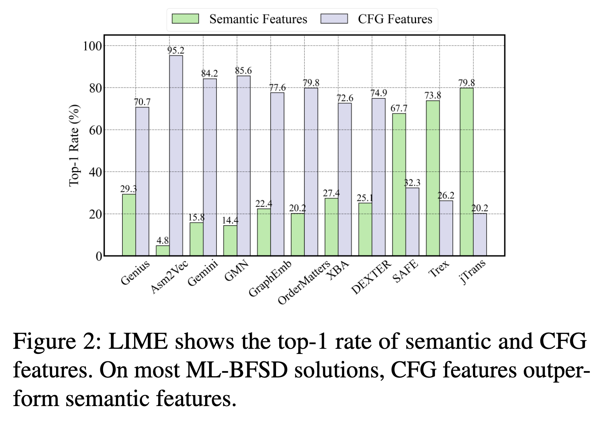
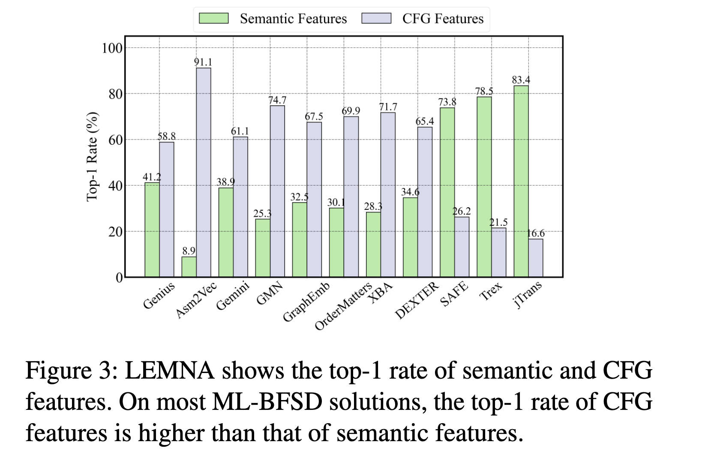
1. **CFG 特征普遍比语义特征更为重要**，即现有模型严重依赖 CFG 特征
2. **CFG top1** 的比率在基于机器学习的模型中远远高于语义特征

# 4. $\delta$ CFG: Assessing the Impact of CFGs
1. 核心思想
   - **不改变语义的情况下，更改 CFG**，以探究 CFG 对模型决策的影响
2. 具体方法：
   1. 基于 CFG
      1. **CFG 不同**
         - 随机选择一对 **CFG 不同**的函数对 $(x,y)$，修改 CFG 使它们一致，比较前后的相似性分数
      2. **CFG 相同**
         - 随机选择一对 **CFG 相同**的函数对 $(x,y)$，修改 CFG 使它们不一致，比较前后的相似性分数
   2. 基于误差
      - 若**具有相同 CFG 但语义不同**的函数 $(x,y)$ 对**比语义相同但 CFG 不同**的函数 $(x,x_2)$ 对得分更高，则说明模型存在过度依赖 CFG 的问题
      - 这也可以探究模型对 CFG 的偏倚会造成何种程度的误差

## 4.1. Methodology
1. 基本块映射
   - $V_{x'}$ 和 $V_{y'}$ 中的每一块都具有**一一对应**的关系 
2. 边映射
   - $E_{x'}$ 和 $E_{y'}$ 中的每一条边都具有**一一对应**的关系
3. 语义保持性
   - $\delta$ CFG 引入了空基本块和额外的边，但是这些改动**不会改变函数的原始语义**
     - 基于**分支条件的控制**实现，i.e., 条件始终为朕

### Basic block match algorithm
1. 确定**相同的入口块**，确保 CFG 从顶层开始是一致的
2. 基于**BFS**的逐层匹配，确保匹配的基本块在同一层上
   - 优先匹配具有直接后继块的基本块
   - 优先匹配具有更多到出口块路径的基本块
3. 处理基本块数量不匹配
   - 如果两个函数剩余的基本块数量不同，则使用**添加空基本块**的方式弥补

### Edge match algorithm
1. 弥补不足边
   - 遍历基本块集合
   - 对于 $b_i$ 的每个后继块的边，检查 $u_i$ 的后继块是否有相应的边连接；如果没有，则补足
2. 双向操作
   - 基于 $b_i$ 检查 $u_i$，再基于 $u_i$ 检查 $b_i$

## 4.2. Implementation
- 基于 `LLVM-IR`，在 `IR` 上编辑 `CFG`，再使用 `Clang` 编译为二进制

### Edge addition
1. 添加 1 条边：`CreateBr`
2. 添加 2 条边：`createCondBr`，即**条件跳转情况**
3. 大于 2 条：`SwitchInst::Create`，即引入 `switch-case` 结构

### Semantics preservation amid edge addition
1. $b_i$ 有一个直接后继，i.e., `ret`：
   - $M=2$：条件跳转，原条件始终为真
   - $M>2$：`Switch-case`，始终走原路径
2. $b_i$ 有两个直接后继，i.e., `if-else`
   - 使用 `switch-case` 结构替换 `if-else` 结构，并将 `ture` 和 `false` 映射为数值，使得只会走对应数值路径，不会走新增路径
3. $b_i$ 有多个后继，
   - 使用 `switch-case` 结构，新增边对应的 `case` 值不与原始值重叠，确保仍然按原路径走
4. 关于 `case` 值的处理，即确保新增 `case` 不与原 `case` 重叠
   -  将原 `C_j` 值映射为与基本块数一致的新 `C_{ej}`
   -  `C_j` >> `C_{ej}`，新增块弥补空缺

# 5. Evaluation on $\delta$ CFG
## 5.1. Change Identical CFGs to Be Different
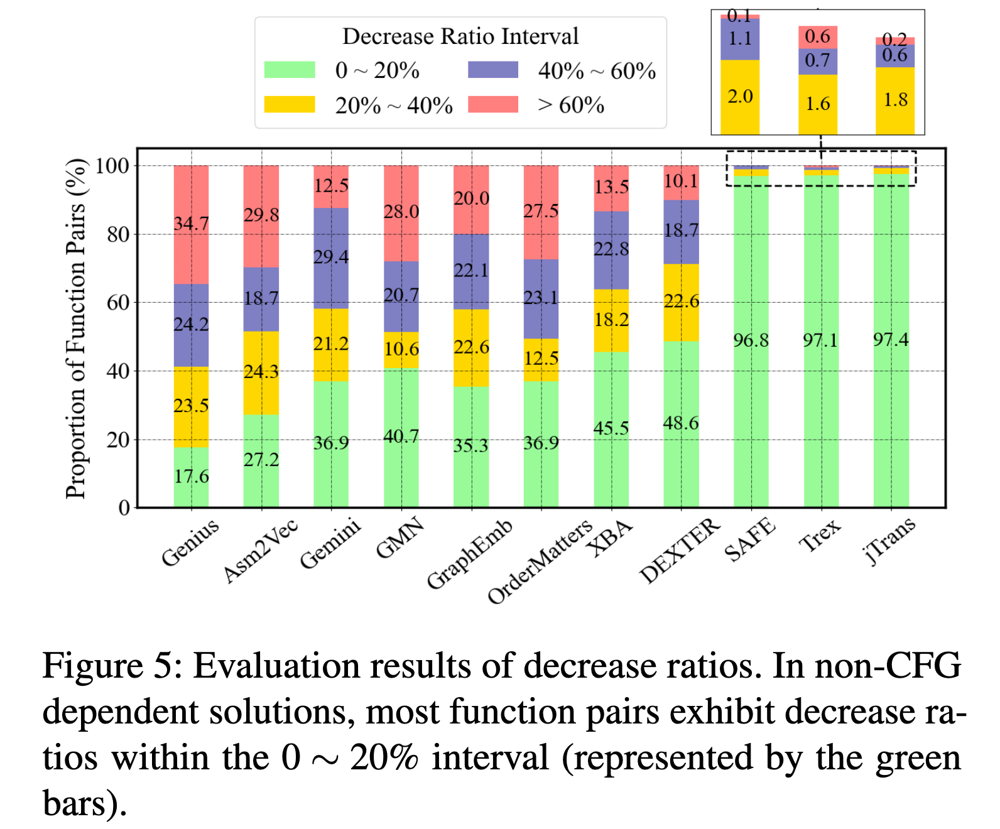
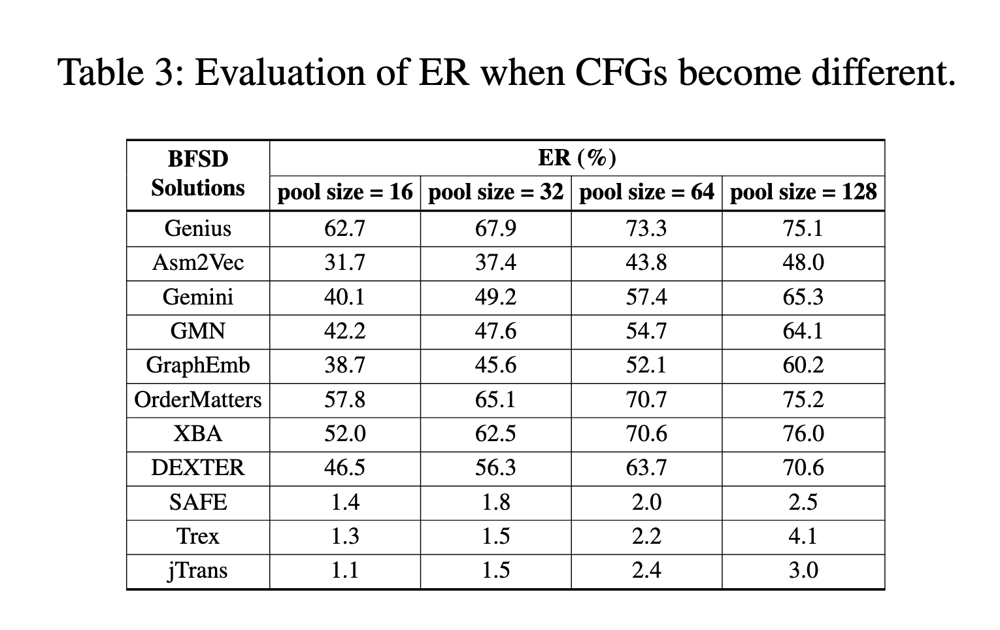
1. 实验设置
   - 数据选择：5000 对**语义相同且 CFG 相同**的函数
   - 实验设计：修改 CFG 探究其对相似性的影响
2. 评价指标
   - 减少比率：修改 CFG 后的相似性评分降低程度
   - 错误率：CFG 变化后模型的误判率
     - 给定 `x`，其最相似函数为 `x2`；修改 `x` 为 `x'`，模型是否仍然能找到 `x2`；模型给出的最相似只要不是 `x2`，皆视为错误
3. 实验结果
   - 1. CFG 依赖模型表现
     - 高减少率和高错误率，说明 CFG 变化会限制影响模型性能
     - 容易产生误判，导致语义相同的函数对被错误识别为不相似
   - 2. 非 CFG 依赖模型表现，即 `SAFE`, `Trex`, `jTrans`
     - 较低减少率和错误率，说明对 CFG 依赖度不高
     - 对 CFG 变化的场景鲁棒性更高

## 5.2. Change Different CFGs to Be Identical
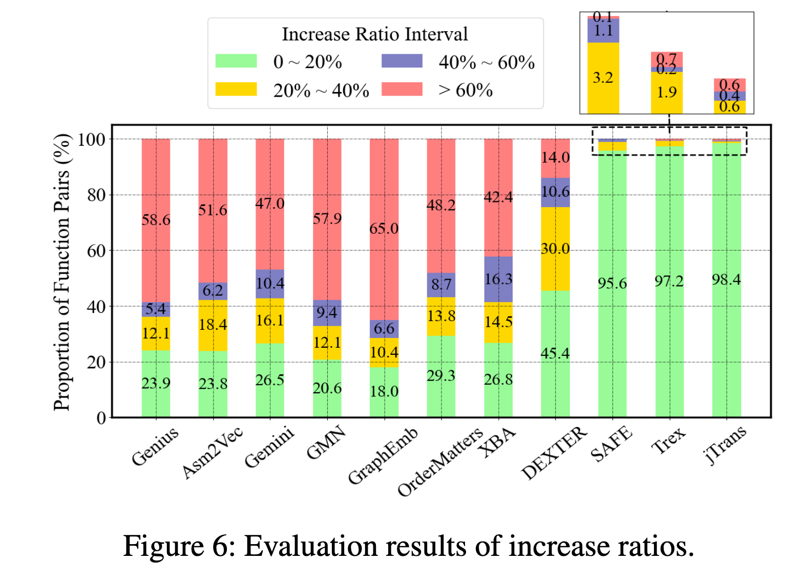
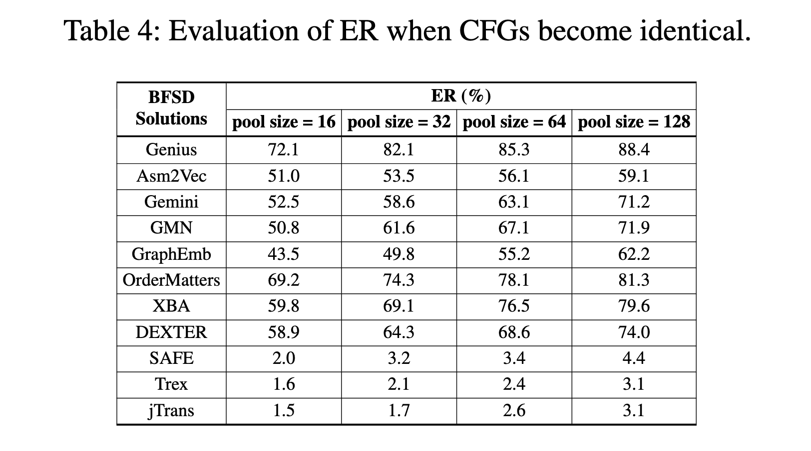
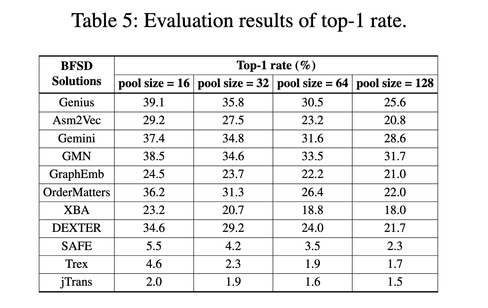
1. 实验设置
   -  随机选择 5,000 对语义不同的函数对 $<x, y>$
   -  将 $<x,y>$ 转换为具有相同 CFG 的 $<x', y'>$，即**不同语义，相同 CFG**
2. 评价指标 
   - 相似性增加比率：$<x'1,y'1>$ 的相似性与 $<x,y>$比较
   - 错误率：$x'$ 是否能匹配 $x$ 的随机编译变体 $x_e$ 为**最相似函数**
   - top-1 比率：用来衡量 **CFG 相同**的情况下模型**误判为最相似的函数对**比例，表明模型的 CFG 依赖性
3. 实验结果
   1. CFG 依赖模型
      - CFG 相同后，具有不同语义的函数对相似性显著上升，甚至**超过 60%**
      - CFG 相同后，模型会倾向于将语义不同的函数识别为相似，错误率绝大部分超过 50%
      - CFG 一致后，许多函数对在函数池中获得 top-1 相似性得分，普遍超过 20%
   2. 非 CFG 依赖模型
      - 各指标都有影响，但是显著低于 CFG 依赖模型

## 5.3 Interpreting CFG Over-reliance
1. 设计缺陷
   1. 手动特征忽视了**指令的执行顺序**，导致关键信息缺失
   2. 忽略**基本块间**的关系
   3. 使用**随机游走**方式训练，导致模型实际学习的基本块数量不足
   4. GNN 模型导致忽略了**远距离的基本块关系**学习
2. 训练集偏差
   1. 数据集可以被分成四类：相同/不同CFG 和 相同/不同语义（排列组合）
   2. 数据集中具有相同 CFG 和不同语义的函数数量远小于相同 CFG 且相同语义的函数数量，使得模型倾向于将 CFG 相同的函数视为相似
3. 建议
   - 除了学习指令本身，还要注重学习**指令的上下文**

## 5.4 Model Performance Improvement
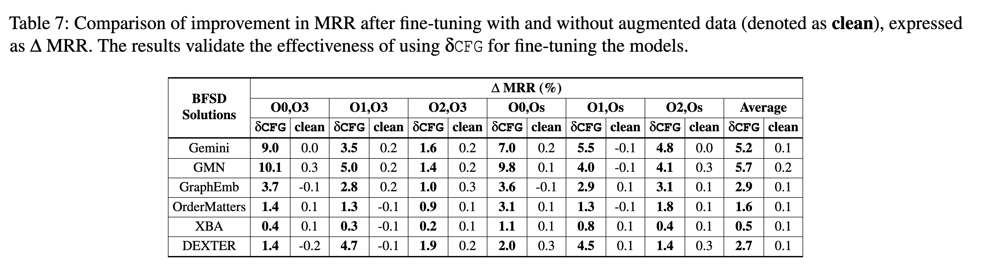
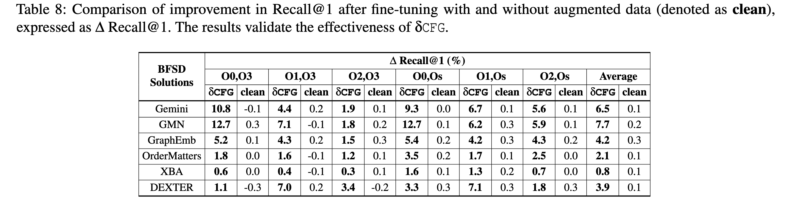
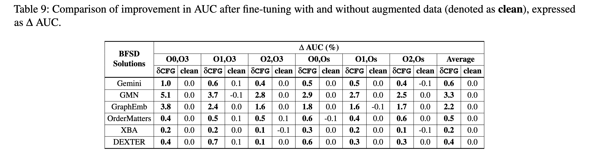
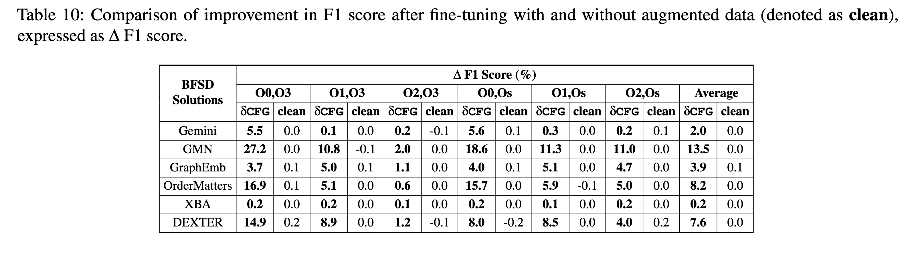
1. 核心思想
   - 通过 $\delta$ CFG 增加**CFG 相同，但语义不同**的函数在训练数据集中的比例
2. 实验结果
   - 指标提升：在 `MRR`, `Recall`, `AUC` 和 `F1` 均有提升
   - 语义重要性：由 `Explainer` 分析得，$\delta$ CFG 增强了对语义特征的敏感性

# Related Knowledge
## 解释方法
- Objective 
  - 解释和理解机器学习模型决策的工具和技术
- Method
  - 揭示模型在**不同特征**上的**权重**，以理解模型最关注那些特征
- Type
  - 1. 基于近似的解释方法：通过构建简单的、可解释的模型来近似复杂模型的决策过程，从而评估每个特征的重要性
  - 2. 基于反向传播的解释方法：利用梯度信息来确定输入特征对模型输出的贡献，常用于深度神经网络
  - 3. 基于扰动的解释方法：通过改变输入数据的特征值，观察模型输出的变化，从而推断特征的重要性

## 基于近似的解释方法
1. 扰动特征值生成变体
   - 对于 $d$ 维的特征向量 $x=[x_1,\cdots, x_d]$，**随机改变某些特征值**，以生成与实例相近的变体
2. 采用可解释模型近似决策边界
   - i.e., 使用 $f$ 作为可解释模型
3. 计算特征贡献
   - 模型 $f$ 会生成一个向量 $a=[a_1,\cdots, a_n]$ ，其中 $a_i$ 表示特征 $x_i$ 对模型在输入实例 $x$ 上决策的贡献值